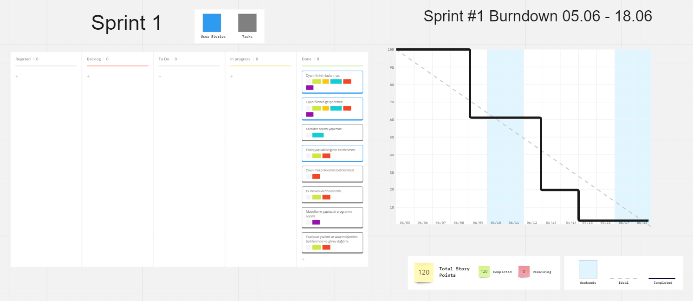
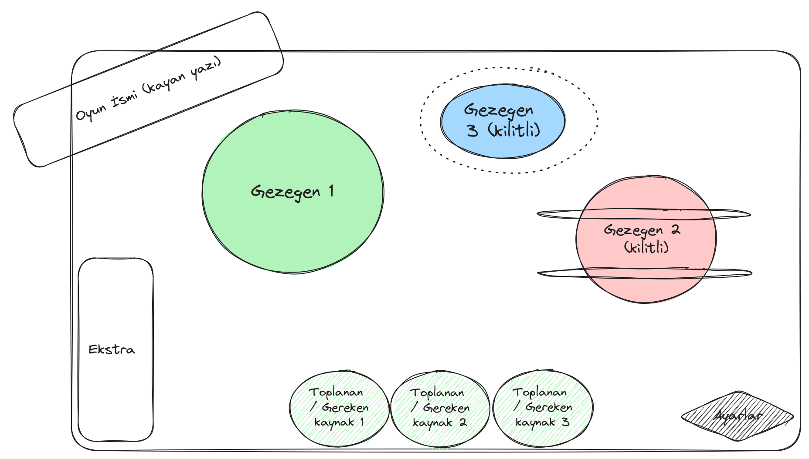
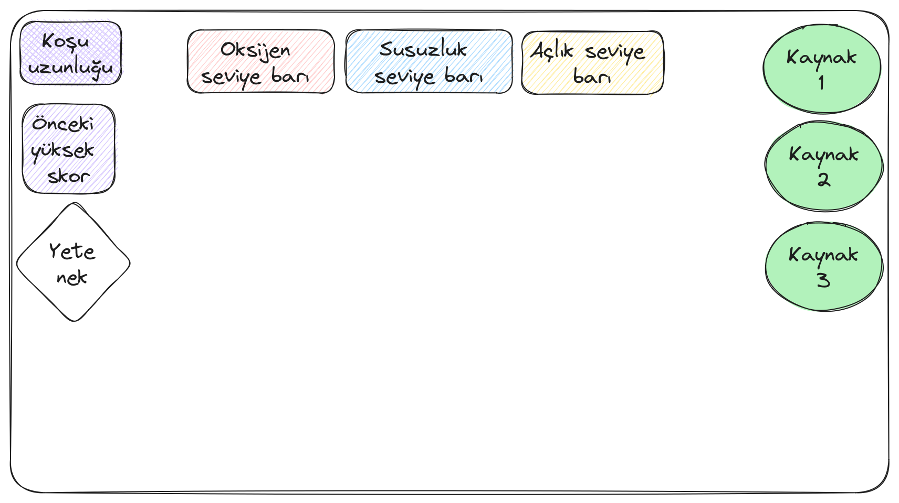
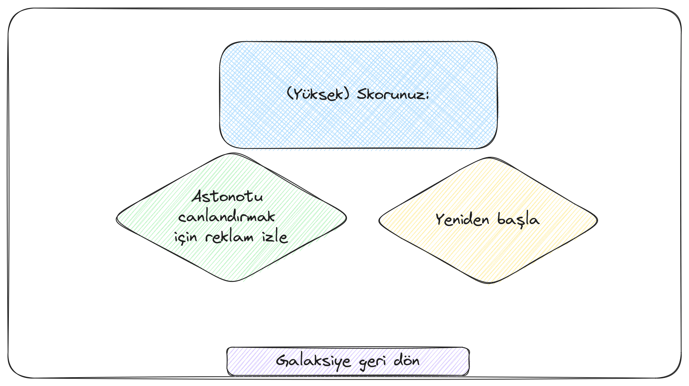

# **Takım İsmi**

Takım Unity U30

# Ürün İle İlgili Bilgiler

## Takım Elemanları
- Büşra Özer: Scrum Master 
- Can Altıntaş: Product Owner
- Kadir Yunus Demir: Developer
- Emirhan Ünsal: Developer
- Selin Tepe: Developer

## Ürün İsmi

Galaktik Toplayıcı

## Product Backlog URL

[Unity Team U30 Miro Backlog Board](https://miro.com/app/board/uXjVM9sms6M=/)

## Ürün Açıklaması

Galaktik Toplayıcı'daki astronotumuz, dünyada yaşamın son bulma tehlikesine karşı diğer gezegenlere keşfe gider. Çıktığı bu keşif yolculuğunda dünyada ihtiyaç olan su, toprak ve tohum malzemelerini ne kadar çok toplayıp dünyaya getirebilirse o kadar başarılı olacaktır. Bu görev süresince, astronotumuzun bu malzemeleri toplaması kolay olmayacaktır. Astronotumuzun ilk defa keşfe gittiği bu gezegenlerde karşısına meteor yağmurları, asit yağmurları, güçlü rüzgarlar ve mini kara delikler çıkacak. Bunların yanında yaşam destek ünitesi için gerekli oksijeni, suyu ve gıdasını da etraftan toplaması gerekecek.

Bu heyecan verici macerada oyuncular, astronotumuzun görevine yardımcı olmak için reflekslerini kullanmalı, doğru zamanda zıplamalı, engellerden kaçmalı ve kaynakları toplamak için stratejik hamleler yapmalıdır. Her gezegende farklı zorluklar ve bulmacalarla karşılaşacak olan oyuncular, becerilerini geliştirirken aynı zamanda çevre bilincini de artıracaktır.

- **Oyunun birincil amacı**: Galaktik Toplayıcı, kaynakların bilinçsiz tüketimi sonucu yaşamın tehdit altında olduğu bir geleceği temsil ediyor. Oyunda ana amacımız, oyunculara kaynakların kıymetini ve sürdürülebilir kullanımının önemini anlatarak çevre bilincini artırmaktır.

- **Oyunun ikincil amacı**: Oyunculara etkiliyici bir atmosferle birlikte görsel ve işitsel bir oyun deneyimi sunarak keyifli zaman geçirmesini sağlamaktır.

## Ürün Özellikleri

- Aksiyon-macera türünde bir oyundur.
- Sonsuz koşu mekaniği üzerine kurulu, eşya toplama ve engellerden kaçınma odaklıdır.
- Kullanıcı dostu arayüzü sayesinde kolaylıkla oynanabilir.
- Düşük dosya boyutu sayesinde mobil ağlardan kolaylıkla indirilebilir.
- Çoklu platform desteği olacaktır.
- Ücretsiz olarak sunulur, gelir modeli reklamlar üzerine kuruludur.
- Çevresel farkındalığı artırmayı hedefleyen bir alt metne sahiptir.

## Hedef Kitle

- Macerayı ve keşfetmeyi sevenler.
- Tempolu ve kısa oyun severler.
- Çevre koruma ve sürdürülebilirlik hassasiyeti olan oyuncular.
- Oyundan görsel ve işitsel keyif almak isteyenler.

## Juriye Not
---

# Sprint 1
- **Sprint Notları**
Final haftasının olması ve iş hayatının yoğun olması sebebiyle oyunun tasarımı yapılmıştır. Takım takviminin ikinci sprintte daha uygun olmasıyla oyunun yazılım ayağının başlangıcı 2. sprint'de yapılmak üzere planlanmıştır.

- **Sprint içinde tamamlanması tahmin edilen puan**: 120 Puan

- **Puan tamamlama mantığı**: İlk sprintte tasarımla ilgili tüm işlerin yapılması kararlaştırıldı. Toplamda 120 puan etmektedir. Diğer sprintlerde de buna benzer puan tamamlama hedefi konulmuştur.

- **Daily Scrum**: Daily Scrum toplantılarının Discord üzerinden yapılmasına karar verilmiştir. Duruma göre WhatsApp üzerinden de ilerlenebileceği kararlaştırılmıştır. Genelde sesli olarak yapılmıştır. Bazı örnekler: 
 [Sprint 1 Daily Scrum Chats](https://docs.google.com/document/d/1QnVF07FE2xcGWiqvcbb8hiIMB0tVE6Ld3ejL8FWiTNY/edit?usp=sharing)

- **Sprint board update**: Sprint board screenshotları: 

  

- **Ürün Durumu**: Ekran görüntüleri:

  ||||
  |------------------------|---------------------------------------|---------------------------------|
  |||
  

- **Sprint Review**: 
  - Oyun tasarımı yapılmış, game design document oluşturulmuş, karakter modellenmiş ve oyun UI konsept tasarımları yapılmıştır. 

- **Sprint Retrospective:**
  - İkinci sprintte verilen görevlerin zamanında yapılması ve iş bölümü kararı alınmıştır.
  - Roller ile ilgili düzenleme yapılmıştır.
  - Takım üyelerinin verilen görevleri zamanında ve istenilen şekilde yapılması istenmiştir.
  - Hedeflerin süre göz önünde bulundurularak küçültümesi kararlaştırılmıştır.
---

## Product Backlog URL

[Unity Team U30 Miro Backlog Board](https://miro.com/app/board/uXjVM9sms6M=/)

---

# Sprint 2

- **Sprint Notları**
Ekip takviminin 2. sprintte daha uygun olması sebebiyle modelleme ve kodlama işlerinin ana bileşenlerinin bu sprintte tamamlanması kararı alınmıştır.

- **Sprint içinde tamamlanması tahmin edilen puan**: 140 Puan

- **Puan tamamlama mantığı**: İlk sprintte tasarımla ilgili işler tamamlanırken 2. sprint iş yoğunluğunun büyük bir kısmını içermesi sebebiyle toplam puana 140 puan olarak etki etmektedir. Diğer sprintlerde de buna benzer puan tamamlama hedefi konulmuştur.

- **Daily Scrum**: Daily Scrum toplantıları whatsApp ve discord üzerinden yapılmaya devam edilmiştir. Daily Scrum toplantısı word olarak Readme'de tarafımızdan paylaşılmaktadır: [Sprint 2 Daily Scrum Chats](https://docs.google.com/document/d/1QnVF07FE2xcGWiqvcbb8hiIMB0tVE6Ld3ejL8FWiTNY/edit)

- **Sprint board update**: Sprint board screenshotları:
  

- **Ürün Durumu**: Ekran görüntüleri:
  
  
  
  
  
  
  
- **Sprint Review**: 
Alınan kararlar: Oyunun modellenmesi yapılmış,UI bağlantıları yapılmış,genel mekanikler tamamlanıp kodlanmış olup var olan tasarımın iyileştirilmesi,müziklerin ve efektlerin eklenmesi,mekaniklerin istenilen şekilde çalışmasının sağlanması,mobil kullanımda test edilmesi kararları alınmıştır.

Sprint Review katılımcıları: Kadir Yunus Demir,Can Altıntaş,Emirhan Ünsal,Selin Tepe,Büşra Özer

- **Sprint Retrospective:**
  - Takım üyelerinin gelecek sprintlerde daha fazla aktif olması gerektiğine vurgu yapılmıştır.
  - Verilen sorumlulukların zamanında yapılması istenmiştir.
  - Takvimde görseli iyileştirme yönünde uygun zaman aralığı oluşturularak düzenleme imkanı bırakılmıştır.
    

---

## Product Backlog URL

[Unity Team U30 Miro Backlog Board](https://miro.com/app/board/uXjVM9sms6M=/)

---

